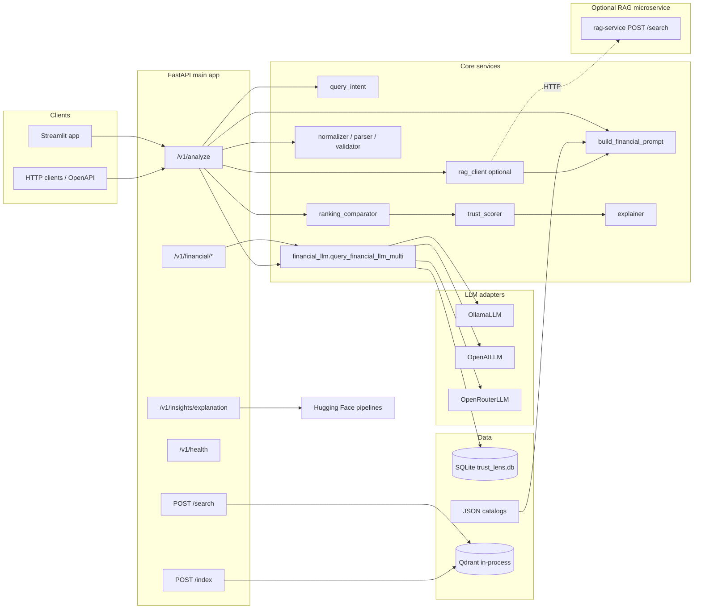

# Trust Lens AI — Project overview

This document describes what the system does, how the pieces fit together, and where to change behavior. It complements **README.md**, which covers installation and day-to-day commands.

## Problem statement

Large language models are useful for generating ranked recommendations and natural-language rationales, but their outputs are **stochastic**, **hard to validate**, and **inconsistent across models**. Trust Lens wraps LLM calls in a small **decision-support pipeline**: fixed product catalogs, structured JSON expectations, parsing and validation, optional **multi-model comparison**, and **quantitative trust signals** derived from agreement between rankings.

The primary domain in this codebase is **financial product ranking** (insurance and loan-style queries), but the patterns (prompt → JSON → normalize → score) apply more broadly.

## High-level architecture

## Repository structure

| Path | Role |
|------|------|
| `app/main.py` | FastAPI factory, lifespan (initializes SQLite), mounts `/v1` router **and** root routers for `indexing` and `search` (no `/v1` prefix). |
| `app/api/v1/router.py` | Registers route modules: `health`, `analyze`, `financial`, `insights`. |
| `app/api/v1/routes/analyze.py` | Main orchestration: intent, optional RAG catalog (`rag_client`), else static catalog; prompt build; multi/single provider run; parse/retry; trust, accuracy vs ground truth when available. |
| `app/api/v1/routes/indexing.py` | `POST /index` — embed insurance + loan JSON from `data_dir` and upsert into Qdrant (`financial_products`). |
| `app/api/v1/routes/search.py` | `POST /search` — query embedding + Qdrant vector search (`top_k`). |
| `app/api/v1/routes/financial.py` | `financial/query` and `financial/recommendation-bias`. |
| `app/api/v1/routes/insights.py` | `insights/explanation` — CPU-bound NLP in a thread. |
| `app/api/v1/routes/health.py` | Simple health payload with version. |
| `app/services/rag_client.py` | Async `fetch_rag_context_for_query`: `POST {RAG_SERVICE_BASE_URL}/search` with `{query, limit}`; builds deduped catalog names and hit payloads for the prompt. |
| `app/services/embedding_service.py` | Sentence-transformers embeddings for `/index` and `/search`. |
| `app/services/qdrant_service.py` | Qdrant client (`QDRANT_HOST` / `QDRANT_PORT`), collection `financial_products`. |
| `app/core/config.py` | Pydantic settings from environment (including `ENV=DEV` mock mode). |
| `app/core/logging.py` | Logging setup used across services. |
| `app/services/analyze.py` | `run_analyze`: `"all"` runs three providers concurrently; non-Ollama requests **fall back to Ollama** on configuration or upstream errors. |
| `app/services/financial_llm.py` | Prompt rendering override path, LLM invocation via `get_llm`, retries, deflection detection, SQLite logging of raw/parsed outputs. Legacy `query_financial_llm` uses **settings-based** OpenAI-compatible HTTP (separate from provider factory). |
| `app/services/tracking_store.py` | SQLite: `llm_responses`, `analyze_runs`; Kendall tau helpers; `list_analyze_history`. |
| `app/services/query_intent.py` | Keyword-based `insurance` vs `loan` intent for catalog selection. |
| `app/services/explanation_insights.py` | Sentiment + zero-shot “price / trust / coverage” factor detection using Transformers pipelines. |
| `app/services/recommendation_bias.py` | Heuristics: hallucination vs catalog, missing ground-truth top picks, brand concentration. |
| `app/services/ranking_consistency.py` | Normalization utilities shared with bias and drift logic. |
| `app/prompts/` | Template registry and `templates/financial_ranking/` system and user prompts. |
| `app/models/` | Pydantic models for API contracts. |
| `app/ml/trust_score_model.py` | `TrustScoreMLP` and toy training utilities (four scalar features → trust); not wired as the live scorer for `/analyze` (live scorer is heuristic in `services/trust/trust_scorer.py`). |
| `services/llm/` | `get_llm(provider)` factory and provider classes reading env vars. |
| `services/trust/` | `compare_rankings`, `compute_trust_score`, `explain_trust`. |
| `services/utils/` | JSON extraction, normalization, catalog validation, query classification helpers. |
| `data/insurance_products.json`, `data/loan_providers.json` | Catalogs whose **names** are injected into prompts and used to validate returned products. |
| `streamlit_app.py` | Calls `POST /v1/analyze` with a single provider; displays metrics when the API returns multi-provider results (the select box does not expose `"all"`; you can still call the API with `"all"` from curl or OpenAPI). |
| `rag-service/` | Standalone FastAPI app: loads embeddings + Qdrant on startup; exposes `POST /index`, `POST /search`, `GET /health`. Intended as the HTTP target for `RAG_SERVICE_BASE_URL` when you want analyze to use retrieval instead of only static JSON names. |

## Request flow: `POST /v1/analyze`

1. **Intent** — `classify_query` scores simple keyword lists → `"insurance"` (default) or `"loan"`.
2. **Catalog source** — `rag_client.fetch_rag_context_for_query` calls the optional RAG service. On success, **catalog names and retrieved hit payloads** drive validation and prompt context. On failure or empty labels, **`load_catalog_product_names`** reads the matching JSON under `settings.data_dir` (default `./data`).
3. **Prompt** — `build_financial_prompt` renders `financial_ranking` templates with the chosen catalog (and optional retrieved snippets).
4. **LLM execution** — `run_analyze` in `app/services/analyze.py`:
   - `provider="all"`: parallel calls to Ollama, OpenAI, OpenRouter; failures become `AnalyzeProviderError` entries rather than failing the whole request.
   - Single provider: OpenAI/OpenRouter may **fall back to Ollama** if the primary call raises configuration or upstream errors.
5. **Shaping** — Raw text is checked for a deflection marker (`LLM_DEFLECTION_MARKER`); JSON is parsed, normalized, and **validated against catalog names**.
6. **Empty ranking retry** — If `ranked_products` is empty after parse, one retry with a strict JSON prefix is attempted per provider.
7. **Multi-provider branch** — `compare_rankings` → `accuracy_score_vs_catalog` merged into metrics → `compute_trust_score` → `explain_trust`; optional `_ground_truth_accuracy_and_trust` enriches the API `accuracy` / `trust_score` fields when ground-truth files exist for the query. Response includes `metrics`, `trust`, and a narrative `explanation`.
8. **Single-provider branch** — Returns simplified `explanation` and `debug` without cross-model `metrics` / `trust`; may still include **`accuracy`** and **`trust_score`** when ground-truth scoring applies.

## Trust and comparison metrics

- **`services/trust/ranking_comparator.py`** — `compare_rankings` builds per-provider rank maps (normalized names), then emits scores such as **`overlap_score`**, **`rank_variance`**, and **`stability_score`** (see implementation for exact definitions on the union of products).
- **`services/trust/accuracy_scorer.py`** — `accuracy_score_vs_catalog` measures how well merged provider rankings cover a catalog-derived sample; injected into comparison metrics before trust aggregation.
- **`services/trust/trust_scorer.py`** — `compute_trust_score` blends stability, catalog alignment accuracy, and overlap:

  `trust_score = clamp(0.4 * stability_score + 0.4 * accuracy_score + 0.2 * overlap_score, 0, 1)`

  If **`accuracy_score`** is omitted from the input dict, it defaults to **`1.0`** so legacy callers that only pass ranking metrics are not over-penalized. **`rank_variance`** is passed through for explanations and API metrics; it does **not** appear in this aggregate formula.

  **Confidence** labels: `high` (≥ 0.7), `medium` (≥ 0.4), else `low`.

- **`services/trust/explainer.py`** — Produces human-readable summary and bullet insights from the metric dict (used in the API `explanation` block for multi-provider runs).

## Vector search vs RAG microservice

- **In-process (main API)** — `POST /index` and `POST /search` live on the **same** FastAPI app as `/v1/*` but are mounted **without** the `/v1` prefix. They use `sentence-transformers` + `qdrant-client` against Qdrant at `QDRANT_HOST`:`QDRANT_PORT`, collection **`financial_products`**. This path is useful for local demos and for keeping retrieval colocated with the ranking API.
- **Optional `rag-service/`** — Separate deployable with its own Qdrant wiring (`rag-service/.env`). The main app’s **`RAG_SERVICE_BASE_URL`** points here; **`rag_client`** expects a JSON body `{ "query", "limit" }` and a response whose **`hits`** list supplies `text` / `metadata` for catalog labels and prompt context. If the call fails, analyze **falls back** to static JSON catalogs.

## LLM providers and configuration

| Provider | Class | Key environment |
|----------|--------|------------------|
| Ollama | `OllamaLLM` | `OLLAMA_BASE_URL` (default `http://localhost:11434`); models default `phi3` with optional fallback `mistral`. |
| OpenAI | `OpenAILLM` | `OPENAI_API_KEY`; base URL `OPENAI_BASE_URL` or `LLM_BASE_URL` or OpenAI default. |
| OpenRouter | `OpenRouterLLM` | `OPENROUTER_API_KEY`; `OPENROUTER_BASE_URL` default `https://openrouter.ai/api/v1`. |

**DEV mock** — When `ENV=DEV` (see `Settings.use_llm_dev_mock`), `query_financial_llm_multi` returns a canned JSON ranking, still optionally writing a tracking row with model name suffix `dev_mock`.

**Legacy path** — `query_financial_llm` (used by `/financial/query`) uses `httpx` against `settings.llm_base_url` with `LLM_API_KEY` / `OPENAI_API_KEY` when not in DEV mode, which is a separate code path from `get_llm` adapters.

## Persistence (SQLite)

- **Database file**: `{TRUST_LENS_DATA_DIR}/trust_lens.db` (WAL mode).
- **`llm_responses`** — Written on successful or parse-failing LLM runs from `query_financial_llm_multi` / related tracking hooks: session id, query text, query hash key, raw content, parsed JSON or parse error, model identifier.
- **`analyze_runs`** — Schema supports trust score, ranking JSON, drift vs prior run, and full snapshot JSON. **`record_analyze_run`** is implemented in `tracking_store.py`; **`GET /v1/history`** reads this table via `list_analyze_history`. If nothing in the app calls `record_analyze_run`, the history endpoint will return an empty list while `llm_responses` may still grow.

## Other API surfaces

### `POST /v1/financial/query`

Renders a registered prompt template (default `financial_ranking`) and returns a validated `FinancialQueryResponse` (ranked products + explanation). Throws 4xx/5xx for unknown templates, misconfiguration, parse errors, or upstream failures.

### `POST /v1/financial/recommendation-bias`

Accepts ordered LLM product names, ordered ground truth, and optional repeated rank-1 names across runs. Returns `bias_detected` and optional `bias_type` among `brand`, `popularity`, `hallucination`.

### `POST /v1/insights/explanation`

Runs **Transformers** pipelines (lazy-loaded, threaded):

- Sentiment: `cardiffnlp/twitter-roberta-base-sentiment-latest`
- Zero-shot factors: `typeform/distilbert-base-uncased-mnli` with candidate labels mapped to **price**, **trust**, **coverage**

First download of these models can take time and disk space.

## Machine learning module (`app/ml`)

`TrustScoreMLP` maps four normalized inputs (`ranking_consistency`, `sentiment`, `feature_coverage`, `llm_confidence`) through a small MLP to a sigmoid trust value. `DummyTrustDataset` and `train_trust_model` support smoke training. This is **experimental / offline** relative to the live API trust computation.

## Dependencies (from `requirements.txt`)

- **Web**: FastAPI, Uvicorn, Pydantic v2, pydantic-settings  
- **HTTP / resilience**: httpx, requests, tenacity  
- **Config**: python-dotenv  
- **ML / NLP**: torch, transformers (version range `<5`), **sentence-transformers** (embeddings for `/index` and `/search`)  
- **Vector**: **qdrant-client** (main app Qdrant integration)  
- **UI**: streamlit, plotly  

The **`rag-service/`** directory has its own dependency file for its FastAPI + Qdrant stack.

## Operational notes

- **Logging** — Structured log lines from `app.core.logging`; adjust `LOG_LEVEL` in `.env`.
- **Security** — Do not commit `.env`; keep API keys out of logs. Production should set `ENVIRONMENT=production` to disable public OpenAPI UIs.
- **Performance** — Multi-provider `analyze` runs three LLM calls in parallel; timeouts depend on each adapter (`OllamaLLM` uses a longer default timeout than OpenAI/OpenRouter).
- **Streamlit** — Helper functions `_render_insights` and `_render_bias` exist in `streamlit_app.py` but are not wired into the current main flow; the primary visualization path uses the API’s `explanation`, `metrics`, and `trust` fields when present.

## Extension ideas (not implemented here)

- Wire `record_analyze_run` from `analyze` (or a background task) so `/v1/history` reflects full analyze snapshots and drift consistently with `llm_responses`.
- Add authentication and rate limiting on `/v1/analyze`.
- Train `TrustScoreMLP` on labeled data and optionally replace or blend with `compute_trust_score`.
- Expand catalogs and intent routing beyond insurance vs loan keywords.
- Unify retrieval: single Qdrant deployment shared by main `/search` and `rag-service`, or consolidate so only one embedding stack is required in production.
